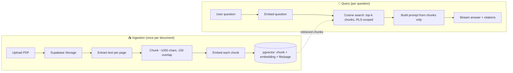

<div align="center">

# 📄 AI Document Analyzer

**Chat with your own documents — grounded, cited, and honest.**

Upload your PDFs and ask questions in plain language. Every answer comes **only** from
your documents, cites the exact **file and page**, and says _"I don't know"_ instead of
guessing when the answer isn't there.

Demo vertical: **HR / onboarding assistant** — company policies & handbooks.

<br />


</div>

---

## ✨ Highlights

- **Retrieval-Augmented Generation (RAG)** — answers are grounded in your documents, never the model's imagination.
- **Traceable citations** — every reply links to the exact file + page, and clicking a citation jumps the PDF preview to that page and **highlights the cited passage**.
- **Honest fallback** — if the retrieved context doesn't contain the answer, the assistant says so.
- **Streaming chat** — token-by-token responses via the Vercel AI SDK.
- **Multi-document scope** — ask one document or "All documents" at once.
- **Guest / demo mode** — a one-click anonymous session lets visitors try the full flow with no signup, then convert to a real account without losing their data.
- **Plans & billing** — `guest / free / pro` tiers with per-plan file-size, file-count, and usage limits, upgraded through Stripe Checkout (test mode).
- **Secure by design** — Row-Level Security on every row; the vector search is scoped to the signed-in user, so no one can retrieve another user's content.
- **i18n-ready** — all copy flows through `next-intl` with type-safe keys.

> _Add a screenshot or a short GIF of the workspace here — it's the single biggest boost to a portfolio README._

---

## 🧠 How it works

Two pipelines over a single vector store. The model **never** sees whole documents — only the small set of chunks retrieved for the current question.



- **Ingestion** — `upload → Supabase Storage → extract (unpdf) → chunk → embed (text-embedding-3-small) → insert into pgvector`.
- **Query** — `embed question → match_chunks() cosine search → prompt with chunks → stream gpt-4o-mini answer with sources`.

Every `documents` / `chunks` row carries a `user_id`, RLS restricts rows to `auth.uid()`, and the `match_chunks` SQL function filters by owner — a search can never leak another user's chunks.

---

## 🛠 Tech Stack

| Layer               | Choice                                                                                 |
| ------------------- | -------------------------------------------------------------------------------------- |
| Framework           | Next.js 16 (App Router), React 19, TypeScript (strict)                                 |
| UI                  | Tailwind CSS v4 + shadcn/ui on **Base UI** primitives                                  |
| LLM plumbing        | Vercel AI SDK v7 (`streamText` + `createUIMessageStream` server, `useChat` client)     |
| Auth · DB · Storage | Supabase — Postgres + **pgvector** + Auth (`@supabase/ssr`) + Storage, RLS on all data |
| Schema / migrations | Prisma 7 — **schema + migrations only** (never runtime data access)                    |
| Models              | OpenAI `text-embedding-3-small` (embeddings) · `gpt-4o-mini` (answers)                 |
| PDF                 | `unpdf` (server extraction) · `react-pdf` (client preview + highlighting)              |
| Billing             | Stripe (test mode) — hosted Checkout + signature-verified webhook                      |
| i18n                | `next-intl` — cookie-based locale, type-safe keys                                      |
| Forms               | `react-hook-form` + `zod` (one schema shared client & server)                          |
| Testing             | Vitest + Testing Library                                                               |

Architecture is **feature-first**: each domain (`auth`, `billing`, `chat`, `documents`, `landing`, `workspace`) owns its full vertical slice under `src/features/`, with cross-cutting code in `src/shared/`. See [`docs/project-analysis.md`](docs/project-analysis.md) for a deep dive.

---

## 🚀 Getting Started

Setup is five steps: **install → configure env → run migrations → run the SQL wiring → configure Supabase Auth**. Budget ~15 minutes for a fresh Supabase project.

### Prerequisites

| Tool             | Version                          | Notes                                                                         |
| ---------------- | -------------------------------- | ----------------------------------------------------------------------------- |
| **Node.js**      | ≥ 20 (22 LTS recommended)        | —                                                                             |
| **pnpm**         | ≥ 10                             | `npm` / `yarn` are **not** supported                                          |
| **Supabase**     | a free project                   | Postgres + Auth + Storage — [supabase.com](https://supabase.com)              |
| **OpenAI**       | an API key                       | for embeddings + answers — [platform.openai.com](https://platform.openai.com) |
| **Stripe** (opt) | a test-mode account + Stripe CLI | only if you want to exercise billing                                          |

### 1. Clone & install

```bash
git clone <your-repo-url>
cd ai-document-analyzer
pnpm install
```

### 2. Configure environment

```bash
cp .env.local.example .env.local
```

Fill in `.env.local` with the following. Supabase values live in **Project Settings → API** and **→ Database**; Stripe values in the Stripe Dashboard.

| Variable                        | Where it comes from                                                       | Required?        |
| ------------------------------- | ------------------------------------------------------------------------- | ---------------- |
| `OPENAI_API_KEY`                | OpenAI dashboard                                                          | ✅ Yes           |
| `NEXT_PUBLIC_SUPABASE_URL`      | Supabase → Settings → API                                                 | ✅ Yes           |
| `NEXT_PUBLIC_SUPABASE_ANON_KEY` | Supabase → Settings → API                                                 | ✅ Yes           |
| `SUPABASE_SERVICE_ROLE_KEY`     | Supabase → Settings → API (server-only, bypasses RLS)                     | ✅ Yes           |
| `DATABASE_URL`                  | Supabase → Database → Connection (pooled, port 6543) — used at runtime    | ✅ Yes           |
| `DIRECT_URL`                    | Supabase → Database → Connection (direct, port 5432) — used by migrations | ✅ Yes           |
| `NEXT_PUBLIC_APP_URL`           | `http://localhost:3000` locally                                           | ✅ Yes           |
| `STRIPE_SECRET_KEY`             | Stripe → Developers → API keys (`sk_test_…`)                              | Only for billing |
| `STRIPE_PRICE_ID`               | Stripe → Product catalog (`price_…`)                                      | Only for billing |
| `STRIPE_WEBHOOK_SECRET`         | `stripe listen …` output (`whsec_…`)                                      | Only for billing |

> ⚠️ **`OPENAI_API_KEY`** is read automatically by the AI SDK but isn't yet listed in `.env.local.example` — add it there so it isn't forgotten.

### 3. Create the database schema (Prisma migrations)

```bash
pnpm prisma:generate   # generate the typed client into src/generated/prisma
pnpm prisma:deploy     # apply all migrations via DIRECT_URL
```

This creates the tables: `profiles`, `documents`, `chunks`, `usage`, `chat_rate_events`.

> **Use `prisma:deploy`, never `prisma migrate dev`.** The migrations include hand-authored cross-schema foreign keys into Supabase's `auth.users`, which the dev command's drift check rejects (error `P4002`).

### 4. Run the Supabase SQL wiring (hand-run, in order)

Prisma can't model Supabase's `auth`/`storage` schemas, RLS policies, triggers, the pgvector index, or the SQL functions. Those live in [`prisma/sql/`](prisma/sql/) and are pasted into the **Supabase Dashboard → SQL Editor** — **copy each file's contents** (not its path) and run them **in this order, after step 3**:

| #   | File                            | Creates                                                                                       |
| --- | ------------------------------- | --------------------------------------------------------------------------------------------- |
| 1   | `prisma/sql/auth_setup.sql`     | `profiles` FK to `auth.users`, RLS, and the new-user trigger                                  |
| 2   | `prisma/sql/ragSetup.sql`       | `pgvector` extension + HNSW index, `documents`/`chunks` RLS, `match_chunks()`                 |
| 3   | `prisma/sql/storageSetup.sql`   | the private **`documents`** Storage bucket + per-user access policies                         |
| 4   | `prisma/sql/billingSetup.sql`   | `usage` RLS + `get_usage()` / `increment_usage()`                                             |
| 5   | `prisma/sql/rateLimitSetup.sql` | `chat_rate_events` RLS + the `check_chat_rate()` sliding-window limiter                       |
| 6   | `prisma/sql/guestCleanup.sql`   | a `pg_cron` job that auto-deletes expired guest users (needs the `pg_cron` extension enabled) |

> Each script depends on the table its migration created — always run migrations (step 3) **before** the matching SQL script, or you'll hit `relation "public.<table>" does not exist`.

### 5. Configure Supabase Auth

In **Supabase Dashboard → Authentication**:

- **Providers → Email → turn OFF "Confirm email"** (and **"Secure email change"**). Sign-up and guest→account conversion sign the user straight in; with confirmation on, no session is issued and the app bounces back to `/sign-in`.
- **Enable "Allow anonymous sign-ins"** — this powers the guest / demo mode.

### 6. (Optional) Stripe billing

Skip this if you don't need the Pro upgrade flow — the app runs fine on the `guest` and `free` plans. To enable it:

```bash
# forward Stripe events to your local webhook; copy the printed whsec_… into .env.local
stripe listen --forward-to localhost:3000/api/stripe/webhook
```

Create a recurring **Product/Price** in the Stripe Dashboard and put its `price_…` in `STRIPE_PRICE_ID`.

### 7. Run it

```bash
pnpm dev        # → http://localhost:3000
```

Then: sign up (or click **Try it** for guest mode) → upload a PDF → wait for status `ready` → ask a question and watch the cited, streamed answer.

---

## 📜 Scripts

| Command                | What it does                                        |
| ---------------------- | --------------------------------------------------- |
| `pnpm dev`             | Dev server at http://localhost:3000                 |
| `pnpm build` / `start` | Production build / serve                            |
| `pnpm lint`            | ESLint                                              |
| `pnpm typecheck`       | `tsc --noEmit`                                      |
| `pnpm test`            | Run the Vitest suite once                           |
| `pnpm test:watch`      | Vitest in watch mode                                |
| `pnpm format`          | Prettier write (tabs, double quotes, Tailwind sort) |
| `pnpm prisma:generate` | Regenerate the Prisma client                        |
| `pnpm prisma:deploy`   | Apply migrations (production-safe)                  |

---

## 📁 Project Structure

```
src/
├── app/            # Routes — kept thin, delegate into features
│   ├── (auth)/     # sign-in, sign-up, forgot/reset password, save-account
│   ├── api/chat/   # POST /api/chat — the RAG query pipeline (streaming)
│   └── api/stripe/ # POST /api/stripe/webhook — subscription sync
├── features/       # Feature-first domains, each self-contained
│   ├── auth/       # actions, service, validators, forms
│   ├── billing/    # Stripe checkout, plan limits, usage meter
│   ├── chat/       # chat types + ChatZone
│   ├── documents/  # upload, ingest, pdf/chunk/embedding libs, preview
│   ├── landing/    # public landing page
│   └── workspace/  # signed-in workspace composition
├── shared/         # Cross-cutting: ui/, components/, config/, lib/, i18n
├── generated/prisma/  # generated client (never edited by hand)
└── middleware.ts   # session refresh + route guarding

prisma/
├── schema.prisma   # Profile, Document, Chunk, Usage, ChatRateEvent
├── migrations/     # hand-authored migrations (see §3)
└── sql/            # hand-run Supabase wiring (see §4)
```

Full documentation lives in [`docs/`](docs/): [`ROADMAP.md`](docs/ROADMAP.md), [`TECH_DEBT.md`](docs/TECH_DEBT.md), [`project-analysis.md`](docs/project-analysis.md), and per-feature docs under [`docs/features/`](docs/features/).

---

## 🔒 Security Notes

- **RLS everywhere.** `profiles`, `documents`, `chunks`, `usage`, `chat_rate_events`, and `storage.objects` all restrict rows to `auth.uid()`.
- **Owner-scoped vector search.** `match_chunks()` runs under RLS and additionally filters `user_id = auth.uid()` — the non-negotiable invariant that keeps documents private.
- **Service-role key stays server-side.** It bypasses RLS and is used **only** by the Stripe webhook (which has no user session); it's never imported into user-facing paths.
- **Plan-gate before paid work.** Upload and `/api/chat` enforce plan limits and the rate limiter **before** any OpenAI call, and meter usage on finish.

---

## 📦 Deployment

Deploys cleanly to **Vercel**:

1. Import the repo, set every variable from step 2 in the Vercel project (use `NEXT_PUBLIC_APP_URL = https://your-domain`).
2. Run `pnpm prisma:deploy` against your production database, then apply the `prisma/sql/*.sql` scripts (step 4) to the production Supabase project.
3. Point a **production** Stripe webhook at `https://your-domain/api/stripe/webhook` and set `STRIPE_WEBHOOK_SECRET` to its signing secret.

---

<div align="center">

Built as a portfolio piece. Not affiliated with OpenAI, Supabase, or Stripe.

</div>
